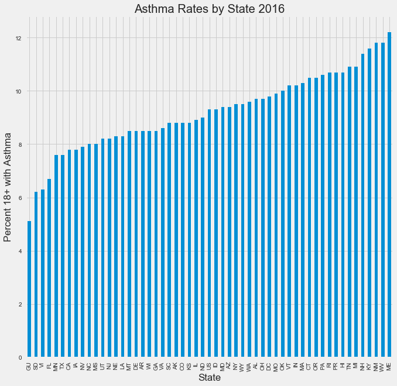

# Exploring and Transforming JSON Schemas

# Introduction

In this lesson, you'll formalize how to explore a JSON file whose structure and schema is unknown to you. This often happens in practice when you are handed a file or stumble upon one with little documentation.

## Objectives
You will be able to:
* Use the JSON module to load and parse JSON documents
* Load and explore unknown JSON schemas
* Convert JSON to a pandas dataframe

## Loading the JSON file

Load the data from the file `disease_data.json`.


```python
import json 
f = open('disease_data.json')
data = json.load(f)
```

## Explore the first and second levels of the schema hierarchy


```python
type(data)
```


    dict


```python
data.keys()
```


    dict_keys(['meta', 'data'])


```python
type(data['meta'])
```


    dict


```python
data['meta'].keys()
```


    dict_keys(['view'])


```python
type(data['data'])
```


    list


```python
len(data['data'])
```


    60266


```python
len(data['data'][0])
```


    42


```python
data['data'][0][9]
```


    '2016'


## Convert to a DataFrame

Create a DataFrame from the JSON file. Be sure to retrive the column names for the dataframe. (Search within the 'meta' key of the master dictionary.) The DataFrame should include all 42 columns.


```python
import pandas as pd
df = pd.DataFrame(data['data'])
print(df.shape)

```

    (60266, 42)


```python
df.columns = [item['name'] for item in data['meta']['view']['columns']]
print(df.columns)
```

    Index(['sid', 'id', 'position', 'created_at', 'created_meta', 'updated_at',
           'updated_meta', 'meta', 'YearStart', 'YearEnd', 'LocationAbbr',
           'LocationDesc', 'DataSource', 'Topic', 'Question', 'Response',
           'DataValueUnit', 'DataValueType', 'DataValue', 'DataValueAlt',
           'DataValueFootnoteSymbol', 'DatavalueFootnote', 'LowConfidenceLimit',
           'HighConfidenceLimit', 'StratificationCategory1', 'Stratification1',
           'StratificationCategory2', 'Stratification2', 'StratificationCategory3',
           'Stratification3', 'GeoLocation', 'ResponseID', 'LocationID', 'TopicID',
           'QuestionID', 'DataValueTypeID', 'StratificationCategoryID1',
           'StratificationID1', 'StratificationCategoryID2', 'StratificationID2',
           'StratificationCategoryID3', 'StratificationID3'],
          dtype='object')


```python
df.head()
```


<div>
<style scoped>
    .dataframe tbody tr th:only-of-type {
        vertical-align: middle;
    }

    .dataframe tbody tr th {
        vertical-align: top;
    }

    .dataframe thead th {
        text-align: right;
    }
</style>
<table border="1" class="dataframe">
  <thead>
    <tr style="text-align: right;">
      <th></th>
      <th>sid</th>
      <th>id</th>
      <th>position</th>
      <th>created_at</th>
      <th>created_meta</th>
      <th>updated_at</th>
      <th>updated_meta</th>
      <th>meta</th>
      <th>YearStart</th>
      <th>YearEnd</th>
      <th>...</th>
      <th>LocationID</th>
      <th>TopicID</th>
      <th>QuestionID</th>
      <th>DataValueTypeID</th>
      <th>StratificationCategoryID1</th>
      <th>StratificationID1</th>
      <th>StratificationCategoryID2</th>
      <th>StratificationID2</th>
      <th>StratificationCategoryID3</th>
      <th>StratificationID3</th>
    </tr>
  </thead>
  <tbody>
    <tr>
      <td>0</td>
      <td>1</td>
      <td>FF49C41F-CE8D-46C4-9164-653B1227CF6F</td>
      <td>1</td>
      <td>1527194521</td>
      <td>959778</td>
      <td>1527194521</td>
      <td>959778</td>
      <td>None</td>
      <td>2016</td>
      <td>2016</td>
      <td>...</td>
      <td>59</td>
      <td>ALC</td>
      <td>ALC2_2</td>
      <td>CRDPREV</td>
      <td>OVERALL</td>
      <td>OVR</td>
      <td>None</td>
      <td>None</td>
      <td>None</td>
      <td>None</td>
    </tr>
    <tr>
      <td>1</td>
      <td>2</td>
      <td>F4468C3D-340A-4CD2-84A3-DF554DFF065E</td>
      <td>2</td>
      <td>1527194521</td>
      <td>959778</td>
      <td>1527194521</td>
      <td>959778</td>
      <td>None</td>
      <td>2016</td>
      <td>2016</td>
      <td>...</td>
      <td>01</td>
      <td>ALC</td>
      <td>ALC2_2</td>
      <td>CRDPREV</td>
      <td>OVERALL</td>
      <td>OVR</td>
      <td>None</td>
      <td>None</td>
      <td>None</td>
      <td>None</td>
    </tr>
    <tr>
      <td>2</td>
      <td>3</td>
      <td>65609156-A343-4869-B03F-2BA62E96AC19</td>
      <td>3</td>
      <td>1527194521</td>
      <td>959778</td>
      <td>1527194521</td>
      <td>959778</td>
      <td>None</td>
      <td>2016</td>
      <td>2016</td>
      <td>...</td>
      <td>02</td>
      <td>ALC</td>
      <td>ALC2_2</td>
      <td>CRDPREV</td>
      <td>OVERALL</td>
      <td>OVR</td>
      <td>None</td>
      <td>None</td>
      <td>None</td>
      <td>None</td>
    </tr>
    <tr>
      <td>3</td>
      <td>4</td>
      <td>0DB09B00-EFEB-4AC0-9467-A7CBD2B57BF3</td>
      <td>4</td>
      <td>1527194521</td>
      <td>959778</td>
      <td>1527194521</td>
      <td>959778</td>
      <td>None</td>
      <td>2016</td>
      <td>2016</td>
      <td>...</td>
      <td>04</td>
      <td>ALC</td>
      <td>ALC2_2</td>
      <td>CRDPREV</td>
      <td>OVERALL</td>
      <td>OVR</td>
      <td>None</td>
      <td>None</td>
      <td>None</td>
      <td>None</td>
    </tr>
    <tr>
      <td>4</td>
      <td>5</td>
      <td>D98DA5BA-6FD6-40F5-A9B1-ABD45E44967B</td>
      <td>5</td>
      <td>1527194521</td>
      <td>959778</td>
      <td>1527194521</td>
      <td>959778</td>
      <td>None</td>
      <td>2016</td>
      <td>2016</td>
      <td>...</td>
      <td>05</td>
      <td>ALC</td>
      <td>ALC2_2</td>
      <td>CRDPREV</td>
      <td>OVERALL</td>
      <td>OVR</td>
      <td>None</td>
      <td>None</td>
      <td>None</td>
      <td>None</td>
    </tr>
  </tbody>
</table>
<p>5 rows × 42 columns</p>
</div>


## Level-Up
## Create a bar graph of states with the highest asthma rates for adults age 18+


```python
df[df.Topic == 'Asthma'].Question.value_counts(normalize=True).cumsum()[:10]
```


    Influenza vaccination among noninstitutionalized adults aged 18-64 years with asthma       0.186096
    Current asthma prevalence among adults aged >= 18 years                                    0.372193
    Influenza vaccination among noninstitutionalized adults aged >= 65 years with asthma       0.558289
    Pneumococcal vaccination among noninstitutionalized adults aged 18-64 years with asthma    0.744385
    Pneumococcal vaccination among noninstitutionalized adults aged >= 65 years with asthma    0.930481
    Asthma prevalence among women aged 18-44 years                                             1.000000
    Name: Question, dtype: float64


```python
cols = ['LocationAbbr', 'LocationDesc', 'DataSource','Topic', 'Question', 'YearStart', 'YearEnd', 'DataValue']
view = df[df.Question == 'Current asthma prevalence among adults aged >= 18 years'][cols]
view.head()
```


<div>
<style scoped>
    .dataframe tbody tr th:only-of-type {
        vertical-align: middle;
    }

    .dataframe tbody tr th {
        vertical-align: top;
    }

    .dataframe thead th {
        text-align: right;
    }
</style>
<table border="1" class="dataframe">
  <thead>
    <tr style="text-align: right;">
      <th></th>
      <th>LocationAbbr</th>
      <th>LocationDesc</th>
      <th>DataSource</th>
      <th>Topic</th>
      <th>Question</th>
      <th>YearStart</th>
      <th>YearEnd</th>
      <th>DataValue</th>
    </tr>
  </thead>
  <tbody>
    <tr>
      <td>4725</td>
      <td>IL</td>
      <td>Illinois</td>
      <td>BRFSS</td>
      <td>Asthma</td>
      <td>Current asthma prevalence among adults aged &gt;=...</td>
      <td>2016</td>
      <td>2016</td>
      <td>6.5</td>
    </tr>
    <tr>
      <td>5529</td>
      <td>IN</td>
      <td>Indiana</td>
      <td>BRFSS</td>
      <td>Asthma</td>
      <td>Current asthma prevalence among adults aged &gt;=...</td>
      <td>2016</td>
      <td>2016</td>
      <td>6.7</td>
    </tr>
    <tr>
      <td>5632</td>
      <td>IA</td>
      <td>Iowa</td>
      <td>BRFSS</td>
      <td>Asthma</td>
      <td>Current asthma prevalence among adults aged &gt;=...</td>
      <td>2016</td>
      <td>2016</td>
      <td>5.6</td>
    </tr>
    <tr>
      <td>6777</td>
      <td>KS</td>
      <td>Kansas</td>
      <td>BRFSS</td>
      <td>Asthma</td>
      <td>Current asthma prevalence among adults aged &gt;=...</td>
      <td>2016</td>
      <td>2016</td>
      <td>6.1</td>
    </tr>
    <tr>
      <td>7034</td>
      <td>KY</td>
      <td>Kentucky</td>
      <td>BRFSS</td>
      <td>Asthma</td>
      <td>Current asthma prevalence among adults aged &gt;=...</td>
      <td>2016</td>
      <td>2016</td>
      <td>6.9</td>
    </tr>
  </tbody>
</table>
</div>


```python
view.sort_values(by='LocationAbbr').head()
```


<div>
<style scoped>
    .dataframe tbody tr th:only-of-type {
        vertical-align: middle;
    }

    .dataframe tbody tr th {
        vertical-align: top;
    }

    .dataframe thead th {
        text-align: right;
    }
</style>
<table border="1" class="dataframe">
  <thead>
    <tr style="text-align: right;">
      <th></th>
      <th>LocationAbbr</th>
      <th>LocationDesc</th>
      <th>DataSource</th>
      <th>Topic</th>
      <th>Question</th>
      <th>YearStart</th>
      <th>YearEnd</th>
      <th>DataValue</th>
    </tr>
  </thead>
  <tbody>
    <tr>
      <td>9797</td>
      <td>AK</td>
      <td>Alaska</td>
      <td>BRFSS</td>
      <td>Asthma</td>
      <td>Current asthma prevalence among adults aged &gt;=...</td>
      <td>2016</td>
      <td>2016</td>
      <td>None</td>
    </tr>
    <tr>
      <td>10013</td>
      <td>AK</td>
      <td>Alaska</td>
      <td>BRFSS</td>
      <td>Asthma</td>
      <td>Current asthma prevalence among adults aged &gt;=...</td>
      <td>2016</td>
      <td>2016</td>
      <td>10.3</td>
    </tr>
    <tr>
      <td>9427</td>
      <td>AK</td>
      <td>Alaska</td>
      <td>BRFSS</td>
      <td>Asthma</td>
      <td>Current asthma prevalence among adults aged &gt;=...</td>
      <td>2016</td>
      <td>2016</td>
      <td>9</td>
    </tr>
    <tr>
      <td>9959</td>
      <td>AK</td>
      <td>Alaska</td>
      <td>BRFSS</td>
      <td>Asthma</td>
      <td>Current asthma prevalence among adults aged &gt;=...</td>
      <td>2016</td>
      <td>2016</td>
      <td>None</td>
    </tr>
    <tr>
      <td>9905</td>
      <td>AK</td>
      <td>Alaska</td>
      <td>BRFSS</td>
      <td>Asthma</td>
      <td>Current asthma prevalence among adults aged &gt;=...</td>
      <td>2016</td>
      <td>2016</td>
      <td>None</td>
    </tr>
  </tbody>
</table>
</div>


```python
df.StratificationCategoryID1.value_counts(normalize=True)
```


    RACE       0.631534
    GENDER     0.231673
    OVERALL    0.136794
    Name: StratificationCategoryID1, dtype: float64


```python
# subset
view = df[(df.Question == 'Current asthma prevalence among adults aged >= 18 years')
         & (df.StratificationCategoryID1 == 'OVERALL')]
view = view.sort_values(by='LocationAbbr')
print(view.shape)
view.head()
```

    (110, 42)


<div>
<style scoped>
    .dataframe tbody tr th:only-of-type {
        vertical-align: middle;
    }

    .dataframe tbody tr th {
        vertical-align: top;
    }

    .dataframe thead th {
        text-align: right;
    }
</style>
<table border="1" class="dataframe">
  <thead>
    <tr style="text-align: right;">
      <th></th>
      <th>sid</th>
      <th>id</th>
      <th>position</th>
      <th>created_at</th>
      <th>created_meta</th>
      <th>updated_at</th>
      <th>updated_meta</th>
      <th>meta</th>
      <th>YearStart</th>
      <th>YearEnd</th>
      <th>...</th>
      <th>LocationID</th>
      <th>TopicID</th>
      <th>QuestionID</th>
      <th>DataValueTypeID</th>
      <th>StratificationCategoryID1</th>
      <th>StratificationID1</th>
      <th>StratificationCategoryID2</th>
      <th>StratificationID2</th>
      <th>StratificationCategoryID3</th>
      <th>StratificationID3</th>
    </tr>
  </thead>
  <tbody>
    <tr>
      <td>9372</td>
      <td>9370</td>
      <td>5D6EDDA9-B241-4498-A262-ED20AB78C44C</td>
      <td>9370</td>
      <td>1527194523</td>
      <td>959778</td>
      <td>1527194523</td>
      <td>959778</td>
      <td>None</td>
      <td>2016</td>
      <td>2016</td>
      <td>...</td>
      <td>02</td>
      <td>AST</td>
      <td>AST1_1</td>
      <td>CRDPREV</td>
      <td>OVERALL</td>
      <td>OVR</td>
      <td>None</td>
      <td>None</td>
      <td>None</td>
      <td>None</td>
    </tr>
    <tr>
      <td>9427</td>
      <td>9425</td>
      <td>332B0889-ED65-4080-9373-D92FE918CD1D</td>
      <td>9425</td>
      <td>1527194523</td>
      <td>959778</td>
      <td>1527194523</td>
      <td>959778</td>
      <td>None</td>
      <td>2016</td>
      <td>2016</td>
      <td>...</td>
      <td>02</td>
      <td>AST</td>
      <td>AST1_1</td>
      <td>AGEADJPREV</td>
      <td>OVERALL</td>
      <td>OVR</td>
      <td>None</td>
      <td>None</td>
      <td>None</td>
      <td>None</td>
    </tr>
    <tr>
      <td>9426</td>
      <td>9424</td>
      <td>CD846EC4-617B-4D38-B287-88DCF9BA8751</td>
      <td>9424</td>
      <td>1527194523</td>
      <td>959778</td>
      <td>1527194523</td>
      <td>959778</td>
      <td>None</td>
      <td>2016</td>
      <td>2016</td>
      <td>...</td>
      <td>01</td>
      <td>AST</td>
      <td>AST1_1</td>
      <td>AGEADJPREV</td>
      <td>OVERALL</td>
      <td>OVR</td>
      <td>None</td>
      <td>None</td>
      <td>None</td>
      <td>None</td>
    </tr>
    <tr>
      <td>9371</td>
      <td>9369</td>
      <td>6BEC61D0-E04B-44BA-8170-F7D6A4C40A09</td>
      <td>9369</td>
      <td>1527194523</td>
      <td>959778</td>
      <td>1527194523</td>
      <td>959778</td>
      <td>None</td>
      <td>2016</td>
      <td>2016</td>
      <td>...</td>
      <td>01</td>
      <td>AST</td>
      <td>AST1_1</td>
      <td>CRDPREV</td>
      <td>OVERALL</td>
      <td>OVR</td>
      <td>None</td>
      <td>None</td>
      <td>None</td>
      <td>None</td>
    </tr>
    <tr>
      <td>9374</td>
      <td>9372</td>
      <td>68F151CE-3084-402C-B672-78A43FBDE287</td>
      <td>9372</td>
      <td>1527194523</td>
      <td>959778</td>
      <td>1527194523</td>
      <td>959778</td>
      <td>None</td>
      <td>2016</td>
      <td>2016</td>
      <td>...</td>
      <td>05</td>
      <td>AST</td>
      <td>AST1_1</td>
      <td>CRDPREV</td>
      <td>OVERALL</td>
      <td>OVR</td>
      <td>None</td>
      <td>None</td>
      <td>None</td>
      <td>None</td>
    </tr>
  </tbody>
</table>
<p>5 rows × 42 columns</p>
</div>


```python
view.DataValueTypeID.value_counts()
```


    AGEADJPREV    55
    CRDPREV       55
    Name: DataValueTypeID, dtype: int64


```python
view = df[(df.Question == 'Current asthma prevalence among adults aged >= 18 years')
         & (df.StratificationCategoryID1 == 'OVERALL')
         & (df.DataValueTypeID == 'CRDPREV')]
view = view.sort_values(by='LocationAbbr')
print(view.shape)
view.head()
```

    (55, 42)


<div>
<style scoped>
    .dataframe tbody tr th:only-of-type {
        vertical-align: middle;
    }

    .dataframe tbody tr th {
        vertical-align: top;
    }

    .dataframe thead th {
        text-align: right;
    }
</style>
<table border="1" class="dataframe">
  <thead>
    <tr style="text-align: right;">
      <th></th>
      <th>sid</th>
      <th>id</th>
      <th>position</th>
      <th>created_at</th>
      <th>created_meta</th>
      <th>updated_at</th>
      <th>updated_meta</th>
      <th>meta</th>
      <th>YearStart</th>
      <th>YearEnd</th>
      <th>...</th>
      <th>LocationID</th>
      <th>TopicID</th>
      <th>QuestionID</th>
      <th>DataValueTypeID</th>
      <th>StratificationCategoryID1</th>
      <th>StratificationID1</th>
      <th>StratificationCategoryID2</th>
      <th>StratificationID2</th>
      <th>StratificationCategoryID3</th>
      <th>StratificationID3</th>
    </tr>
  </thead>
  <tbody>
    <tr>
      <td>9372</td>
      <td>9370</td>
      <td>5D6EDDA9-B241-4498-A262-ED20AB78C44C</td>
      <td>9370</td>
      <td>1527194523</td>
      <td>959778</td>
      <td>1527194523</td>
      <td>959778</td>
      <td>None</td>
      <td>2016</td>
      <td>2016</td>
      <td>...</td>
      <td>02</td>
      <td>AST</td>
      <td>AST1_1</td>
      <td>CRDPREV</td>
      <td>OVERALL</td>
      <td>OVR</td>
      <td>None</td>
      <td>None</td>
      <td>None</td>
      <td>None</td>
    </tr>
    <tr>
      <td>9371</td>
      <td>9369</td>
      <td>6BEC61D0-E04B-44BA-8170-F7D6A4C40A09</td>
      <td>9369</td>
      <td>1527194523</td>
      <td>959778</td>
      <td>1527194523</td>
      <td>959778</td>
      <td>None</td>
      <td>2016</td>
      <td>2016</td>
      <td>...</td>
      <td>01</td>
      <td>AST</td>
      <td>AST1_1</td>
      <td>CRDPREV</td>
      <td>OVERALL</td>
      <td>OVR</td>
      <td>None</td>
      <td>None</td>
      <td>None</td>
      <td>None</td>
    </tr>
    <tr>
      <td>9374</td>
      <td>9372</td>
      <td>68F151CE-3084-402C-B672-78A43FBDE287</td>
      <td>9372</td>
      <td>1527194523</td>
      <td>959778</td>
      <td>1527194523</td>
      <td>959778</td>
      <td>None</td>
      <td>2016</td>
      <td>2016</td>
      <td>...</td>
      <td>05</td>
      <td>AST</td>
      <td>AST1_1</td>
      <td>CRDPREV</td>
      <td>OVERALL</td>
      <td>OVR</td>
      <td>None</td>
      <td>None</td>
      <td>None</td>
      <td>None</td>
    </tr>
    <tr>
      <td>9373</td>
      <td>9371</td>
      <td>5FCE0D49-11FD-4545-B9E7-14F503123105</td>
      <td>9371</td>
      <td>1527194523</td>
      <td>959778</td>
      <td>1527194523</td>
      <td>959778</td>
      <td>None</td>
      <td>2016</td>
      <td>2016</td>
      <td>...</td>
      <td>04</td>
      <td>AST</td>
      <td>AST1_1</td>
      <td>CRDPREV</td>
      <td>OVERALL</td>
      <td>OVR</td>
      <td>None</td>
      <td>None</td>
      <td>None</td>
      <td>None</td>
    </tr>
    <tr>
      <td>9375</td>
      <td>9373</td>
      <td>D3F00ED2-A069-4E40-B42B-5A2528A91B6F</td>
      <td>9373</td>
      <td>1527194523</td>
      <td>959778</td>
      <td>1527194523</td>
      <td>959778</td>
      <td>None</td>
      <td>2016</td>
      <td>2016</td>
      <td>...</td>
      <td>06</td>
      <td>AST</td>
      <td>AST1_1</td>
      <td>CRDPREV</td>
      <td>OVERALL</td>
      <td>OVR</td>
      <td>None</td>
      <td>None</td>
      <td>None</td>
      <td>None</td>
    </tr>
  </tbody>
</table>
<p>5 rows × 42 columns</p>
</div>


```python
import matplotlib.pyplot as plt
%matplotlib inline
```


```python
view.DataValue = view.DataValue.astype(float)
view = view.sort_values(by='DataValue')
view.set_index('LocationAbbr')['DataValue'].plot(kind='bar', figsize=(10,10))
plt.title('Asthma Rates by State 2016')
plt.ylabel('Percent 18+ with Asthma')
plt.xlabel('State')
plt.style.use('fivethirtyeight')
```





## Summary

Well done! In this lab you got some extended practice exploring the structure of JSON files, converting json files to pandas DataFrame, and visualizing data!
